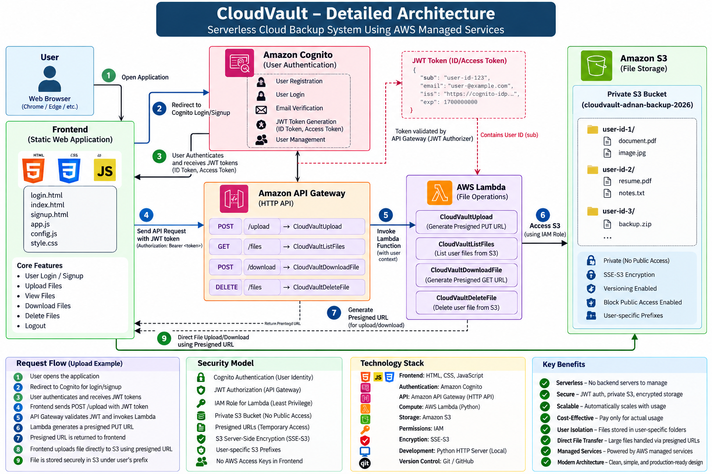
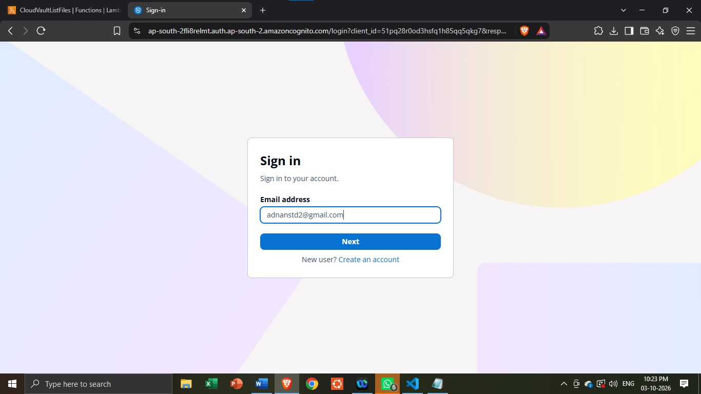
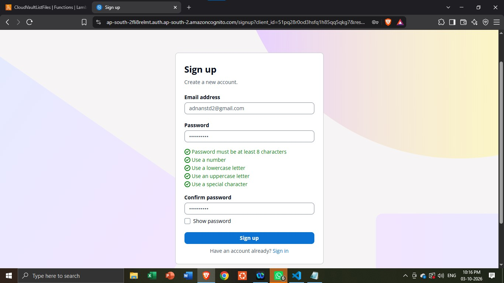
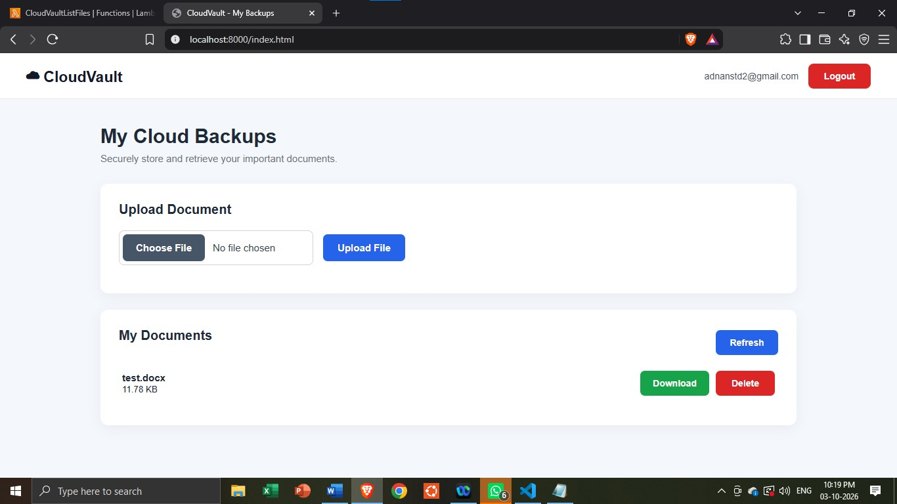
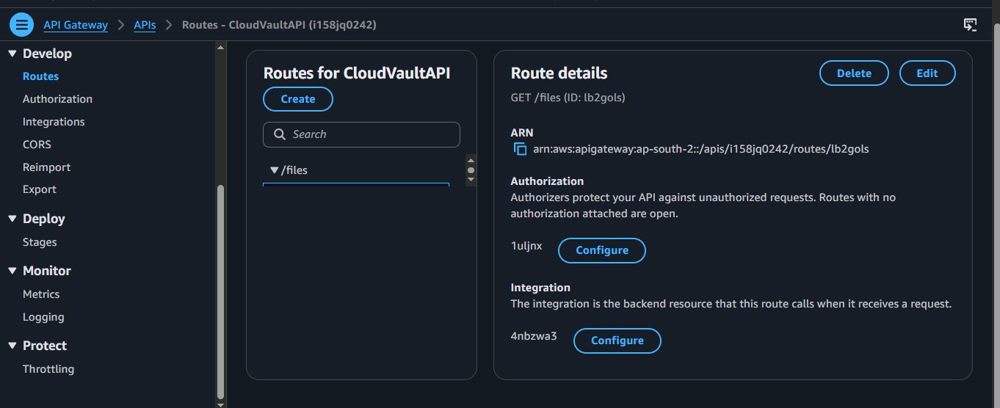
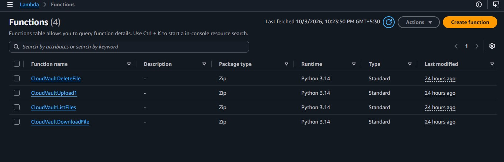
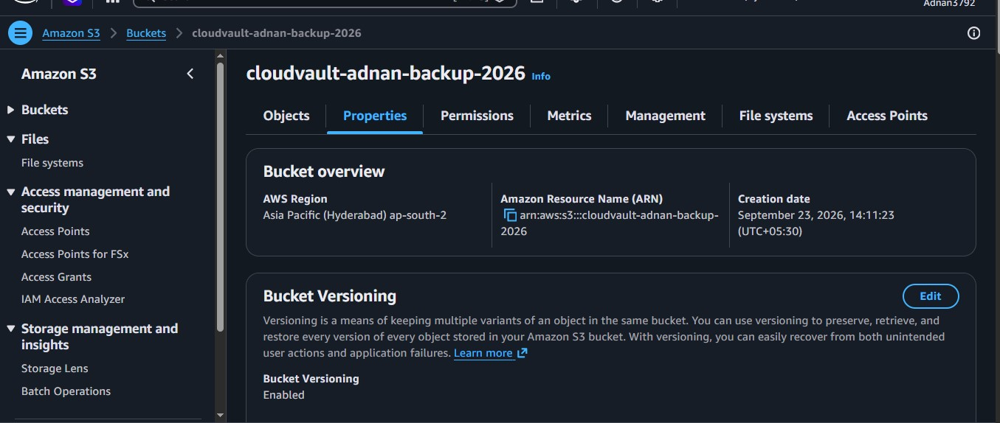
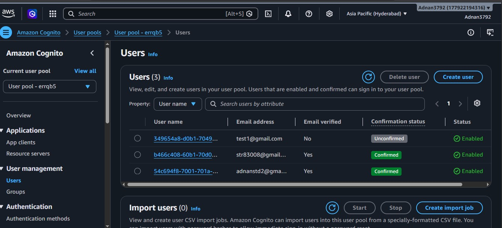
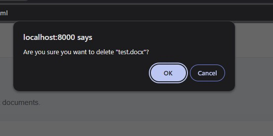

# ☁️ CloudVault

## Serverless Cloud Backup & File Management System

CloudVault is a serverless cloud-based file backup and file management application built using AWS managed services.

The application allows authenticated users to securely:

- Create an account
- Sign in and sign out
- Upload files
- View stored files
- Download files
- Delete files

CloudVault uses **Amazon Cognito** for authentication, **Amazon API Gateway** for the HTTP API, **AWS Lambda** for backend file operations, **Amazon S3** for private file storage, and **AWS IAM** for controlled access.

A key part of the project is the use of **S3 presigned URLs**. Lambda generates temporary upload and download URLs so the browser can transfer files directly to S3 without making the bucket public or exposing AWS secret credentials in the frontend.

-

# 📌 Project Overview

CloudVault is a practical serverless cloud application designed to provide secure file storage and management.

The application has a static web frontend and a serverless AWS backend.

```text
User
 │
 ▼
Frontend
 │
 ├──────────────► Amazon Cognito
 │                  Authentication
 │
 ▼
Amazon API Gateway
 │
 │ JWT Authorization
 ▼
AWS Lambda
 │
 │ IAM Role
 ▼
Amazon S3
 │
 ▼
Private File Storage
```

There is no continuously running traditional backend server.

AWS managed services handle authentication, API requests, backend processing, and file storage.

---

# ❗ Problem Statement

A cloud file-management application needs to solve several problems:

- Users need secure authentication.
- API endpoints need to be protected.
- Files should remain private.
- Users should only work with their own files.
- The application needs backend logic for file operations.
- Large files should not unnecessarily pass through the backend.
- AWS credentials should not be exposed in browser code.
- The application should avoid unnecessary server infrastructure.

CloudVault addresses these requirements using AWS serverless services.

---

# 💡 Solution

Each part of the application has a specific responsibility:

| Requirement | CloudVault Solution |
|---|---|
| User authentication | Amazon Cognito |
| API authentication | Cognito JWT Authorizer |
| HTTP API | Amazon API Gateway |
| Backend logic | AWS Lambda |
| File storage | Amazon S3 |
| AWS permissions | IAM |
| Temporary file access | S3 Presigned URLs |
| File isolation | Cognito user ID / S3 prefix |
| Storage encryption | S3 SSE-S3 |
| Public access protection | S3 Block Public Access |

The result is a simple serverless architecture where the browser, API, compute, authentication, and storage layers are separated.

---

# ✨ Features

## 🔐 User Authentication

CloudVault uses Amazon Cognito for authentication.

Users can:

- Register an account
- Verify their email
- Sign in
- Sign out
- Receive authentication tokens

---

## 🔑 JWT-Based API Authorization

After authentication, the frontend receives a Cognito access token.

Authenticated API requests include:

```http
Authorization: Bearer <access-token>
```

API Gateway validates the JWT before invoking the Lambda function.

---

## 📤 Secure File Upload

Users can select a file from the dashboard and upload it to their private storage.

The backend generates a temporary S3 presigned PUT URL.

The browser then uploads the file directly to S3.

---

## 📋 File Listing

Authenticated users can view their stored files.

The dashboard displays information such as:

- File name
- File size
- Last modified time

Only the authenticated user's S3 prefix is queried.

---

## 📥 File Download

Users can download their stored files through the dashboard.

Lambda generates a temporary S3 presigned GET URL and returns it to the frontend.

The browser then downloads the file directly from S3.

---

## 🗑️ File Deletion

Users can delete files from their dashboard.

The delete request is sent through API Gateway to Lambda, which removes the corresponding S3 object.

---

## 👤 User-Specific Storage

Each user's files are stored under a prefix based on their Cognito user ID.

Example:

```text
cloudvault-adnan-backup-2026/
│
├── user-id-001/
│   ├── resume.pdf
│   └── document.pdf
│
├── user-id-002/
│   ├── notes.txt
│   └── image.jpg
│
└── user-id-003/
    └── backup.zip
```

Object keys follow:

```text
<user-id>/<filename>
```

This provides logical separation between users.

---

# 🏗️ Architecture

CloudVault uses the following architecture:

```text
                    ┌───────────────────┐
                    │       User        │
                    │   Web Browser     │
                    └─────────┬─────────┘
                              │
                              ▼
                    ┌───────────────────┐
                    │     Frontend      │
                    │   HTML/CSS/JS     │
                    └─────────┬─────────┘
                              │
                 ┌────────────┴────────────┐
                 │                         │
                 ▼                         ▼
        ┌─────────────────┐       ┌─────────────────┐
        │ Amazon Cognito  │       │ API Gateway     │
        │ Authentication  │       │    HTTP API     │
        └─────────────────┘       └────────┬────────┘
                                           │
                                           ▼
                                  ┌─────────────────┐
                                  │   AWS Lambda    │
                                  │                 │
                                  │ Upload          │
                                  │ List            │
                                  │ Download        │
                                  │ Delete          │
                                  └────────┬────────┘
                                           │
                                      IAM Role
                                           │
                                           ▼
                                  ┌─────────────────┐
                                  │    Amazon S3    │
                                  │ Private Bucket  │
                                  └─────────────────┘
```

---

# 🖼️ Architecture Diagram

The project includes a dedicated architecture diagram in the `docs` directory.



The diagram shows:

- User and web browser
- Frontend
- Amazon Cognito
- JWT authentication
- API Gateway
- Lambda functions
- IAM access
- Amazon S3
- Presigned URL flow
- User-specific file storage

---

# 🔄 How It Works

The complete application flow is:

```text
1. User opens CloudVault
          │
          ▼
2. User authenticates with Cognito
          │
          ▼
3. Cognito provides JWT tokens
          │
          ▼
4. Frontend sends authenticated request
          │
          ▼
5. API Gateway validates JWT
          │
          ▼
6. API Gateway invokes Lambda
          │
          ▼
7. Lambda performs file operation
          │
          ▼
8. Lambda uses IAM role to access S3
          │
          ▼
9. Response is returned to frontend
```

For uploads and downloads, Lambda generates a temporary presigned URL and the browser communicates directly with S3.

---

# 🔐 Authentication

CloudVault uses Amazon Cognito for user authentication.

The authentication flow is:

```text
Browser
   │
   │ Login / Signup
   ▼
Amazon Cognito
   │
   │ Authentication
   ▼
Authorization Code
   │
   ▼
Frontend
   │
   │ Token Exchange
   ▼
Cognito Token Endpoint
   │
   ▼
Access Token / ID Token
   │
   ▼
Authenticated API Requests
```

The access token is sent to API Gateway as a Bearer token.

API Gateway validates the token using the Cognito JWT authorizer.

---

# 📤 File Upload

The upload process is:

```text
User selects file
       │
       ▼
Frontend
       │
       │ POST /upload
       ▼
API Gateway
       │
       │ JWT validation
       ▼
CloudVaultUpload Lambda
       │
       │ Generate presigned PUT URL
       ▼
Frontend
       │
       │ PUT file
       ▼
Amazon S3
```

The actual file does not need to be uploaded through Lambda.

This allows the browser to transfer the file directly to S3 using a temporary URL.

---

# 📋 File Listing

The file listing process is:

```text
Frontend
   │
   │ GET /files
   ▼
API Gateway
   │
   │ JWT validation
   ▼
CloudVaultListFiles
   │
   │ User-specific prefix
   ▼
Amazon S3
   │
   ▼
File metadata
   │
   ▼
Frontend
```

The Lambda function uses the authenticated user's ID to determine which S3 prefix to list.

---

# 📥 File Download

The download process is:

```text
User clicks Download
       │
       ▼
Frontend
       │
       │ POST /download
       ▼
API Gateway
       │
       │ JWT validation
       ▼
CloudVaultDownloadFile
       │
       │ Generate presigned GET URL
       ▼
Frontend
       │
       │ GET file
       ▼
Amazon S3
```

The S3 bucket remains private.

---

# 🗑️ File Deletion

The deletion process is:

```text
User clicks Delete
       │
       ▼
Frontend
       │
       │ DELETE /files
       ▼
API Gateway
       │
       │ JWT validation
       ▼
CloudVaultDeleteFile
       │
       │ DeleteObject
       ▼
Amazon S3
       │
       ▼
Success response
```

---

# 🔒 Security

CloudVault uses multiple security controls.

### Amazon Cognito

Provides:

- User authentication
- User identity
- JWT tokens
- Email verification

### API Gateway JWT Authorization

API Gateway validates the Cognito JWT before invoking Lambda.

### Private S3 Bucket

The S3 bucket is not publicly accessible.

### IAM

Lambda uses an IAM execution role instead of AWS credentials stored in frontend code.

### Presigned URLs

Temporary URLs are generated for file upload and download.

### Encryption

S3 Server-Side Encryption (SSE-S3) is enabled.

### User Isolation

Files are stored using:

```text
<user-id>/<filename>
```

---

# 🔗 Presigned URL Design

CloudVault uses presigned URLs to provide temporary access to private S3 objects.

## Upload

```text
Lambda
  │
  │ Presigned PUT URL
  ▼
Frontend
  │
  │ Upload
  ▼
S3
```

## Download

```text
Lambda
  │
  │ Presigned GET URL
  ▼
Frontend
  │
  │ Download
  ▼
S3
```

This means the S3 bucket does not need to be public and the frontend does not need AWS secret credentials.

---

# 🔌 API Routes

| Method | Route | Purpose | Lambda |
|---|---|---|---|
| `POST` | `/upload` | Generate upload URL | CloudVaultUpload |
| `GET` | `/files` | List user files | CloudVaultListFiles |
| `POST` | `/download` | Generate download URL | CloudVaultDownloadFile |
| `DELETE` | `/files` | Delete file | CloudVaultDeleteFile |

All routes are protected by Cognito JWT authorization.

---

# ⚙️ Lambda Functions

## CloudVaultUpload

Generates a temporary S3 PUT presigned URL.

Main responsibilities:

- Read authenticated user ID
- Receive filename
- Build S3 object key
- Generate upload URL
- Return URL to frontend

---

## CloudVaultListFiles

Lists files belonging to the authenticated user.

Main responsibilities:

- Read authenticated user ID
- Build S3 prefix
- List S3 objects
- Return file metadata

---

## CloudVaultDownloadFile

Generates a temporary S3 GET presigned URL.

Main responsibilities:

- Read authenticated user ID
- Build S3 object key
- Generate download URL
- Return URL to frontend

---

## CloudVaultDeleteFile

Deletes a user's file from S3.

Main responsibilities:

- Read authenticated user ID
- Build S3 object key
- Delete S3 object
- Return operation status

---

# ☁️ AWS Services

| AWS Service | Role in CloudVault |
|---|---|
| **Amazon Cognito** | Authentication and user identity |
| **Amazon API Gateway** | HTTP API and JWT authorization |
| **AWS Lambda** | Serverless backend operations |
| **Amazon S3** | Private file storage |
| **AWS IAM** | Lambda permissions |
| **S3 Presigned URLs** | Temporary file upload/download access |

---

# 🗄️ S3 Configuration

The CloudVault S3 bucket is configured as private.

Important configuration:

```text
Block Public Access  → Enabled
ACLs                 → Disabled
Versioning           → Enabled
Encryption           → SSE-S3
```

Files are stored using user-specific prefixes.

```text
Bucket
│
├── user-id-1/
│   ├── file1.pdf
│   └── file2.jpg
│
├── user-id-2/
│   └── notes.txt
│
└── user-id-3/
    └── backup.zip
```

---

# 🔐 IAM Configuration

Lambda uses an IAM execution role to access the S3 bucket.

The required permissions include:

```text
s3:ListBucket
s3:PutObject
s3:GetObject
s3:DeleteObject
```

The frontend does not receive AWS access keys.

The architecture is:

```text
Lambda
  │
  │ IAM Execution Role
  ▼
S3
```

---

# 👥 Cognito Configuration

Amazon Cognito is responsible for:

- User registration
- Email-based sign-in
- Email verification
- User identity
- OAuth authorization code flow
- JWT token generation
- Logout

The Cognito user's `sub` claim is used to identify the user's S3 storage prefix.

---

# 🌐 API Gateway Configuration

CloudVault uses an HTTP API with the following routes:

```text
POST   /upload
GET    /files
POST   /download
DELETE /files
```

A Cognito JWT authorizer protects the API.

The frontend sends:

```http
Authorization: Bearer <JWT>
```

---

# 🌍 CORS Configuration

CORS is configured because the frontend and AWS services use different origins during local development.

The local frontend runs at:

```text
http://localhost:8000
```

API Gateway allows the required frontend origin, HTTP methods, and headers.

S3 also has CORS configuration for browser-based file uploads and downloads.

---

# 🖥️ Frontend

The frontend is built using:

- HTML5
- CSS3
- JavaScript

Main pages:

```text
login.html
signup.html
index.html
```

### Login

Provides the entry point for user authentication through Cognito.

### Signup

Redirects users to the Cognito registration flow.

### Dashboard

Provides:

- User information
- File upload
- File listing
- Download
- Delete
- Refresh
- Logout

---

# 📂 Project Structure

```text
CloudVault/
│
├── frontend/
│   ├── index.html
│   ├── login.html
│   ├── signup.html
│   ├── style.css
│   ├── app.js
│   └── config.js
│
├── backend/
│   ├── upload/
│   │   └── lambda_function.py
│   ├── list-files/
│   │   └── lambda_function.py
│   ├── download/
│   │   └── lambda_function.py
│   └── delete/
│       └── lambda_function.py
│
├── docs/
│   ├── architecture.png
│   ├── architecture.md
│   ├── api-routes.jpg
│   ├── cloudvault-dashboard.jpg
│   ├── deleting-files.jpg
│   ├── lambda-functions.jpg
│   ├── s3bucket.jpg
│   ├── signin.jpg
│   ├── signup.jpg
│   └── user-pool.jpg
│
├── .gitignore
└── README.md


# ⚙️ Configuration

The frontend uses `config.js` for client-side configuration.

Example:

```javascript
const CONFIG = {
    CLIENT_ID: "YOUR_COGNITO_CLIENT_ID",

    COGNITO_DOMAIN:
        "YOUR_COGNITO_DOMAIN",

    API_BASE_URL:
        "YOUR_API_GATEWAY_URL",

    LOGIN_REDIRECT_URI:
        "http://localhost:8000",

    LOGOUT_REDIRECT_URI:
        "http://localhost:8000/login.html"
};
```

These values are browser-side configuration.

Do not put AWS secret credentials in this file.

---

# 🔐 Sensitive Information

Never commit the following to GitHub:

```text
AWS Access Key ID
AWS Secret Access Key
Passwords
Private API Keys
Database Credentials
JWT Signing Secrets
Authentication Tokens
Presigned URLs
Private Certificates
```

Lambda accesses S3 using its IAM execution role rather than storing AWS credentials in the application.

---

# 🐛 Challenges Solved

## S3 Regional Endpoint

Browser uploads initially encountered an S3 regional endpoint issue.

The Lambda S3 client was configured with the correct regional endpoint so that generated presigned URLs use the correct S3 region.

## S3 CORS

Direct browser-to-S3 transfers require CORS configuration.

The S3 bucket was configured for the local frontend origin and required browser methods.

## API Gateway JWT Authorization

The API needed to allow authenticated users while protecting the routes from unauthenticated requests.

A Cognito JWT authorizer was configured in API Gateway.

## User-Specific Storage

Files needed to be separated between users.

The Cognito `sub` claim is used to create:

```text
<user-id>/<filename>
```

## Presigned URLs

The S3 bucket needed to remain private while still allowing the browser to upload and download files.

Lambda generates temporary presigned URLs for this purpose.

## Frontend Authentication

The frontend handles the Cognito authorization callback, exchanges the authorization code for tokens, and uses the access token for API requests.

---

# ⚠️ Current Limitations

The current version focuses on the core file-management workflow.

Current limitations include:

- No Terraform infrastructure yet
- No automated CI/CD deployment yet
- No CloudFront deployment yet
- No scheduled backup jobs yet
- No file search
- No pagination for large file lists
- Limited filename validation
- No advanced file-type validation
- No production monitoring dashboard
- Frontend currently runs locally during development

---

# 🔮 Future Improvements

## Infrastructure as Code

Use Terraform to manage:

```text
S3
IAM
Lambda
API Gateway
Cognito
```

## CI/CD

Add GitHub Actions or GitLab CI/CD for:

```text
Code Push
   ↓
Lint
   ↓
Security Scan
   ↓
Build
   ↓
Deploy
```

## Monitoring

Add CloudWatch monitoring for:

- Lambda logs
- API errors
- Lambda duration
- Application activity
- Operational alerts

## File Validation

Add:

- File size limits
- File type validation
- MIME type validation
- Filename sanitization
- Path traversal protection

## S3 Lifecycle Management

Add lifecycle rules for:

- Old files
- Archived files
- Infrequently accessed data
- Automatic expiration

## Improved File Management

Potential additions:

- Search
- Sorting
- Pagination
- Folder support
- File preview
- Rename
- Bulk deletion
- Bulk download

## Production Deployment

A future production deployment could use:

```text
CloudFront
    │
    ▼
Static Frontend
    │
    ▼
API Gateway
    │
    ▼
Lambda
    │
    ▼
S3
```

---

# 📸 Screenshots

The following screenshots are available in the `docs` directory.

## 1. Sign In



Shows the CloudVault authentication interface and Cognito sign-in flow.

---

## 2. Sign Up



Shows the account registration interface.

---

## 3. CloudVault Dashboard



Shows the main dashboard where users can upload, view, download, and delete files.

---

## 4. API Routes



Shows the configured API Gateway routes used by CloudVault.

---

## 5. Lambda Functions



Shows the Lambda functions responsible for the application's file operations.

---

## 6. S3 Bucket



Shows the CloudVault S3 storage configuration.

---

## 7. User Pool



Shows the Amazon Cognito user pool used for authentication.

---

## 8. File Deletion



Shows the file deletion functionality in the CloudVault dashboard.

---

# 📚 Documentation

Additional technical documentation is available in:

```text
docs/
├── architecture.png
```

The architecture documentation provides a visual and technical overview of:

- Frontend
- Cognito
- API Gateway
- Lambda
- IAM
- S3
- Authentication
- Presigned URLs
- File flow

---

# 🧠 What I Learned

Building CloudVault provided practical experience with:

### AWS

- Amazon S3
- AWS Lambda
- Amazon API Gateway
- Amazon Cognito
- AWS IAM
- S3 CORS
- Presigned URLs

### Cloud Security

- JWT authentication
- JWT authorization
- IAM permissions
- Private S3 storage
- Server-side encryption
- Temporary access
- User-specific storage

### Backend

- Serverless backend design
- HTTP APIs
- JSON request/response handling
- Boto3
- S3 object operations

### Frontend

- JavaScript Fetch API
- OAuth authentication flow
- Token handling
- File upload
- File download
- Dynamic file listing
- API integration

### Development

- Git
- GitHub
- Linux/WSL
- AWS troubleshooting
- CORS troubleshooting
- Cloud service integration

---

# 🛠️ Tech Stack

| Category | Technologies |
|---|---|
| Frontend | HTML5, CSS3, JavaScript |
| Backend | Python, Boto3, AWS Lambda |
| Authentication | Amazon Cognito |
| API | Amazon API Gateway |
| Storage | Amazon S3 |
| Authorization | Cognito JWT + IAM |
| Encryption | S3 SSE-S3 |
| File Transfer | S3 Presigned URLs |
| Version Control | Git, GitHub |
| Development | VS Code, WSL |

---

# ⭐ Project Highlights

- ☁️ Serverless AWS architecture
- 🔐 Cognito authentication
- 🪪 JWT-protected API
- ⚡ AWS Lambda backend
- 🗄️ Private Amazon S3 storage
- 🔗 Temporary S3 presigned URLs
- 👤 User-specific file isolation
- 🔑 IAM-controlled access
- 🔒 SSE-S3 encryption
- 🌐 API Gateway HTTP API
- 📤 Direct browser-to-S3 uploads
- 📥 Direct browser-to-S3 downloads
- 🧩 Separate Lambda functions for file operations

---

# 👨‍💻 Author

## Muhammad Adnan

**B.Tech Computer Science & Engineering**

Dehradun, Uttarakhand, India

### GitHub

https://github.com/Adnan3792

### LinkedIn

https://linkedin.com/in/muhammad-adnan-140396252

---

# 📄 License

This project is developed for educational and portfolio purposes.
